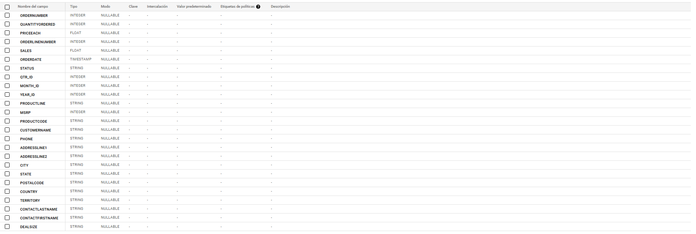
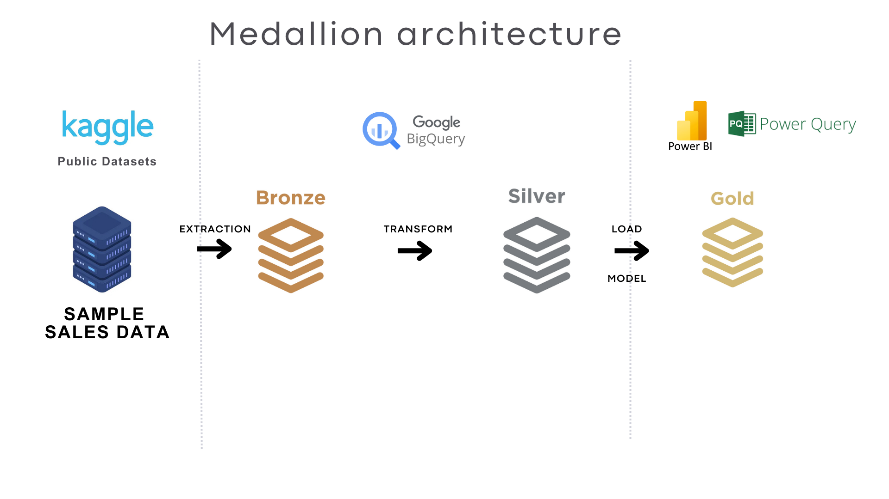
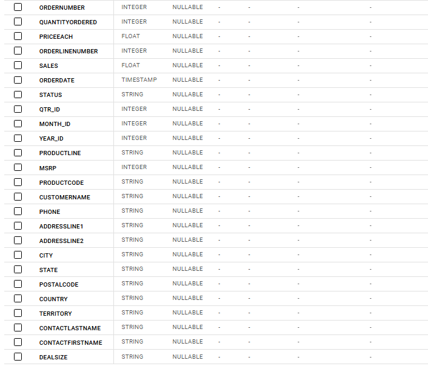
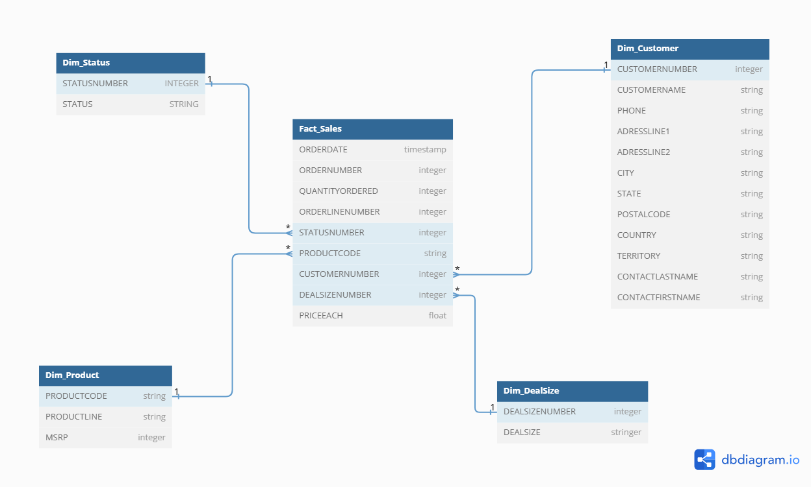

# Edvai_Data_Analysis
Proyecto final-Análisis de Ventas de Vehículos de Modelos a Escala
# Análisis de Ventas de Vehículos de Modelos a Escala

Este proyecto tiene como objetivo analizar las ventas de productos coleccionables, específicamente vehículos de modelos a escala, utilizando métricas clave (KPIs) y visualizaciones avanzadas para identificar patrones, tendencias y oportunidades de mejora en las operaciones comerciales.

## Caso de Estudio

Se utilizó un conjunto de datos proveniente de **Kaggle**, que representa transacciones de ventas de modelos a escala en diferentes categorías y tamaños de tratos. Este análisis permite explorar el comportamiento de los clientes, el rendimiento de las líneas de producto y las tendencias de ventas en distintas regiones y temporalidades.

## Herramientas

- **BigQuery**: Para almacenar y transformar los datos en una arquitectura Medallion (Bronze, Silver y Gold), permitiendo la construcción de tablas dimensionales y de hechos para el análisis.
- **Power Query**: Utilizado para la limpieza adicional de los datos y su integración en Power BI.
- **Power BI**: Para la creación de dashboards interactivos que destacan métricas clave, como `Sales` totales, crecimiento interanual y cancelaciones.
- **Canva** y **Figma**: Utilizados para diseñar elementos visuales, mejorar la presentación de los dashboards y documentar el proyecto de manera profesional.

## Metodología de Análisis

Se crearon dashboards interactivos en **Power BI** para representar métricas clave (KPIs) y evaluar hipótesis relacionadas con el desempeño de productos, hábitos de compra, tamaños de transacción (`DealSize`) y tendencias regionales. Adicionalmente, herramientas de diseño gráfico fueron utilizadas para optimizar la presentación visual del proyecto.

## Objetivos del Proyecto

1. Examinar tendencias de compra y analizar el comportamiento de los consumidores respecto a las categorías de productos.
2. Evaluar la influencia de las estaciones del año en el volumen de ventas.
3. Comparar la participación de diferentes regiones en los resultados de `Sales` totales.
4. Identificar oportunidades para aumentar la rentabilidad en productos de alta y baja rotación.
5. Proponer estrategias basadas en los tamaños de trato (`DealSize`) y el comportamiento de los clientes.

## Hipótesis de Negocio

1. Las ventas (`Sales`) aumentan durante el último trimestre del año debido a la estacionalidad de compras.
2. Las líneas de producto `Vintage Cars` y `Classic Cars` generan la mayor proporción de ingresos totales.
3. Los tratos de tamaño `Large` son los que más ingresos (`Sales`) generan, a pesar de ser menos frecuentes.
4. El territorio `NA` lidera en ingresos (`Sales`), siendo la región que más ingresos genera.
5. Se observa una disminución en nuevos clientes (`CustomersNew`) en el periodo de transición entre 2003 y 2004.

## Plan de Métricas

Para validar las hipótesis planteadas, se han definido **18 indicadores clave (KPIs)** que facilitan el análisis del comportamiento de los clientes y el desempeño de las transacciones.

A continuación, se presentan las métricas seleccionadas, acompañadas de su metodología de cálculo y las perspectivas desde las que pueden ser evaluadas. Información más detallada se encuentra disponible en la documentación del [Plan de Métricas](./plan-de-metricas).


## Desarrollo del Proyecto

### Descripción de la Fuente de Datos
El conjunto de datos utilizado es un archivo **CSV** que contiene **25 columnas** de información y **2823 registros**. Los datos documentan transacciones comerciales de modelos a escala en diversas categorías, tamaños de trato (`DealSize`) y regiones, proporcionando una valiosa fuente para analizar tendencias de ventas, comportamiento del cliente y desempeño de productos.



## Data Flow

A continuación, se detalla el flujo de datos utilizado para la Extracción, Transformación y Carga de Datos (ETL) en el proyecto:



Se consideraron los siguientes aspectos para la manipulación de la base de datos:

### Entorno de Trabajo
Las consultas están diseñadas para ejecutarse en **Google Cloud Platform > BigQuery**, utilizando la sintaxis específica de este entorno.

### Capa Bronze
- Se subió el archivo **CSV**, que contiene **25 columnas** y **2823 registros**, como la tabla `Sales` en el conjunto de datos `my_project_bronze` dentro del proyecto denominado `tpintegradorev`.
- En esta capa, los datos se almacenan sin modificaciones para conservar su estado original.

### Capa Silver
- En esta etapa, se transformaron y depuraron los datos provenientes de la capa Bronze.
- Se creó la tabla `Sales` en el conjunto de datos `my_project_silver`. Esta tabla contiene únicamente registros con valores completos en campos clave:
  - `ORDERNUMBER`
  - `ORDERDATE`
  - `STATUS`
  - `PRODUCTLINE`
  - `PRODUCTCODE`
  - `CUSTOMERNAME`
  - `DEALSIZE`

Para realizar esta transformación, se utilizó la siguiente consulta:

```sql
-- Crear tabla Sales en la capa Silver --
CREATE OR REPLACE TABLE `tpintegradorev.my_project_silver.Sales` AS
SELECT *
FROM `tpintegradorev.my_project_bronze.SalesA2`
WHERE
  ORDERNUMBER IS NOT NULL
  AND ORDERDATE IS NOT NULL
  AND STATUS IS NOT NULL
  AND PRODUCTLINE IS NOT NULL
  AND PRODUCTCODE IS NOT NULL
  AND CUSTOMERNAME IS NOT NULL
  AND DEALSIZE IS NOT NULL;
```````

## Data Mart

En el contexto de este proyecto, el Data Mart fue diseñado para centralizar y organizar la información clave relacionada con las ventas de modelos a escala, facilitando el análisis de datos mediante la segmentación y almacenamiento eficiente de los parámetros más relevantes.

Previamente, se realiza un proceso de limpieza para asegurar la calidad de los datos utilizados. En este caso, los datos fueron preprocesados para eliminar valores nulos (NULL) y registros duplicados, garantizando que la información sea confiable y lista para el análisis.

Posteriormente, para el modelado y normalización de los datos, se creó un Data Mart con un modelo tipo estrella compuesto por 5 tablas dimensionales y 1 tabla de hechos.




# Modelo de Datos y Scripts SQL

Este modelo permite estructurar los datos de manera eficiente, agrupándolos en categorías como:

- **Transacciones (Fact_Sales)**: Contiene los datos clave de las ventas, incluyendo cantidades, fechas y precios.
- **Clientes (Dim_Customer)**: Información detallada sobre los clientes, como nombres, contactos y ubicación.
- **Estados de Pedido (Dim_Status)**: Mapeo de los diferentes estados de los pedidos.
- **Productos (Dim_Product)**: Detalles sobre los productos vendidos, como códigos, líneas de producto y precios sugeridos.
- **Tamaños de Trato (Dim_DealSize)**: Clasificación de las ventas por tamaño de trato (Small, Medium, Large).

## Scripts de Consultas

A continuación, se presentan los scripts utilizados para la creación de las tablas del Data Mart:


```sql
-- Creación de la tabla Fact_Sales
CREATE OR REPLACE TABLE `tpintegradorev.my_project_silver.Fact_Sales` AS 
SELECT 
    s.ORDERNUMBER,
    s.ORDERDATE,
    s.QUANTITYORDERED,
    s.ORDERLINENUMBER,
    ds.STATUSNUMBER,
    s.PRODUCTCODE,
    dc.CUSTOMERNUMBER,
    dd.DEALSIZENUMBER,
    s.PRICEEACH
FROM `tpintegradorev.my_project_silver.Sales` s
LEFT JOIN `tpintegradorev.my_project_silver.Dim_Status` ds 
    ON s.STATUS = ds.STATUS
LEFT JOIN `tpintegradorev.my_project_silver.Dim_Customer` dc 
    ON s.CUSTOMERNAME = dc.CUSTOMERNAME AND s.CITY = dc.CITY
LEFT JOIN `tpintegradorev.my_project_silver.Dim_DealSize` dd 
    ON s.DEALSIZE = dd.DEALSIZE;

-- Creación de la tabla Dim_Customer
CREATE OR REPLACE TABLE `tpintegradorev.my_project_silver.Dim_Customer` AS 
SELECT 
    ROW_NUMBER() OVER (ORDER BY CUSTOMERNAME, CITY) AS CUSTOMERNUMBER,
    CUSTOMERNAME,
    PHONE,
    ADDRESSLINE1,
    ADDRESSLINE2,
    CITY,
    STATE,
    POSTALCODE,
    COUNTRY,
    TERRITORY,
    CONTACTLASTNAME,
    CONTACTFIRSTNAME
FROM (
    SELECT DISTINCT 
        CUSTOMERNAME, 
        PHONE, 
        ADDRESSLINE1, 
        ADDRESSLINE2, 
        CITY, 
        STATE, 
        POSTALCODE, 
        COUNTRY, 
        TERRITORY, 
        CONTACTLASTNAME, 
        CONTACTFIRSTNAME
    FROM `tpintegradorev.my_project_silver.Sales`
)
WHERE CUSTOMERNAME IS NOT NULL
ORDER BY CUSTOMERNUMBER;

-- Creación de la tabla Dim_Status
CREATE OR REPLACE TABLE `tpintegradorev.my_project_silver.Dim_Status` AS 
SELECT  
    ROW_NUMBER() OVER (ORDER BY STATUS) AS STATUSNUMBER,
    STATUS
FROM (
    SELECT DISTINCT STATUS
    FROM `tpintegradorev.my_project_silver.Sales`
)
WHERE STATUS IS NOT NULL
ORDER BY STATUSNUMBER;

-- Creación de la tabla Dim_Product
CREATE OR REPLACE TABLE `tpintegradorev.my_project_silver.Dim_Product` AS 
SELECT 
    PRODUCTCODE,
    PRODUCTLINE,
    MSRP
FROM (
    SELECT DISTINCT 
        PRODUCTCODE, 
        PRODUCTLINE, 
        MSRP
    FROM `tpintegradorev.my_project_silver.Sales`
)
WHERE PRODUCTCODE IS NOT NULL
ORDER BY PRODUCTCODE;

-- Creación de la tabla Dim_DealSize
CREATE OR REPLACE TABLE `tpintegradorev.my_project_silver.Dim_DealSize` AS 
SELECT 
    ROW_NUMBER() OVER (ORDER BY DEALSIZE DESC) AS DEALSIZENUMBER,
    DEALSIZE
FROM (
    SELECT DISTINCT DEALSIZE
    FROM `tpintegradorev.my_project_silver.Sales`
)
WHERE DEALSIZE IS NOT NULL
ORDER BY DEALSIZE DESC;
```````
# Métricas de Rendimiento

Para este proyecto, se utilizaron medidas DAX para calcular los KPIs que se describen en el plan de métricas. A continuación, se detallan las medidas creadas en la tabla **Medidas**:

## Métricas

### Ventas por Cliente
`Total_Sales_Per_Customer = CALCULATE([002 $ Total_Sales], RELATEDTABLE(Dim_Customer))`

### Clientes Activos
`Active_Clients = DISTINCTCOUNT(Fact_Sales[CUSTOMERNUMBER])`

### Ranking de Clientes
`Customer_Ranking = RANKX(ALL(Dim_Customer), [014 $ Total_Sales_Per_Customer], , DESC, DENSE)`

### Nuevos Clientes por Año
`New_Customers_Per_Year = CALCULATE(DISTINCTCOUNT(Fact_Sales[CUSTOMERNUMBER]), FILTER(Fact_Sales, YEAR(Fact_Sales[ORDERDATE]) = YEAR(CALCULATE(MIN(Fact_Sales[ORDERDATE]), ALLEXCEPT(Fact_Sales, Fact_Sales[CUSTOMERNUMBER])))))`

### Pedidos Cancelados
`Order_cancelled = CALCULATE(COUNT(Fact_Sales[ORDERNUMBER]), Dim_Status[STATUS] = "Cancelled")`

### Órdenes Totales
`Total_Orders = COUNT(Fact_Sales[ORDERNUMBER])`

### Porcentaje de Pedidos Cancelados
`Percentage_Cancelled = DIVIDE([009 $ Order_cancelled], [010 $ Total_Orders], 0)`

### Ingresos Perdidos
`Lost_Revenue = -CALCULATE(SUMX(Fact_Sales, Fact_Sales[QUANTITYORDERED] * Fact_Sales[PRICEEACH]), Dim_Status[STATUS] = "Cancelled")`

### Porcentaje de Ingresos Perdidos
`Percentage_Lost_Revenue = DIVIDE([012 $ Lost_Revenue], [002 $ Total_Sales], 0)`

### Número Total de Transacciones
`Transaction_numbers = DISTINCTCOUNT(Fact_Sales[ORDERNUMBER])`

### Cantidad Total Pedida
`Total_Quantity_Ordered = SUM(Fact_Sales[QUANTITYORDERED])`

### Total Ventas
`Total_Sales = SUMX(Fact_Sales, Fact_Sales[QUANTITYORDERED] * Fact_Sales[PRICEEACH])`

### Precio Promedio
`Average_Price = AVERAGE(Fact_Sales[PRICEEACH])`

### Promedio Ventas por Pedido
`Sales_Average_Order = AVERAGEX(VALUES(Fact_Sales[ORDERNUMBER]), SUMX(FILTER(Fact_Sales, Fact_Sales[ORDERNUMBER] = EARLIER(Fact_Sales[ORDERNUMBER])), Fact_Sales[QUANTITYORDERED] * Fact_Sales[PRICEEACH]))`

### Mes con Mejor Desempeño
`Top_Performing_Month = FIRSTNONBLANK(TOPN(1, VALUES(Dim_Calendar[MonthName]), CALCULATE([002 $ Total_Sales])), 1)`

### Ventas del Año Anterior
`Total_Sales_PY = CALCULATE([002 $ Total_Sales], SAMEPERIODLASTYEAR(Dim_Calendar[Date]))`

### Crecimiento Interanual
`YoY_Growth = IF(ISBLANK([002 $ Total_Sales]), BLANK(), DIVIDE([002 $ Total_Sales] - CALCULATE([002 $ Total_Sales], SAMEPERIODLASTYEAR(Dim_Calendar[Date])), CALCULATE([002 $ Total_Sales], SAMEPERIODLASTYEAR(Dim_Calendar[Date]))))`

### Objetivo de Ventas
`Sale_Target = [002 $ Total_Sales] * 'Parámetro'[Valor de Parámetro]`

---

# Análisis de Datos

El análisis de datos se realizó con un enfoque descriptivo y comparativo. Se creó un reporte compuesto por:

- **1 Portada**
- **8 Dashboards**

Los dashboards destacan aspectos clave de las ventas y presentan visualizaciones específicas para abordar cada una de las hipótesis de negocio. Esto permitió identificar **insights relevantes** para el proyecto.

### Objetivo del Diseño
Los dashboards fueron diseñados con el objetivo de facilitar la comprensión de las visualizaciones, destacando las métricas principales y su relación con los datos, garantizando un análisis claro y efectivo.


