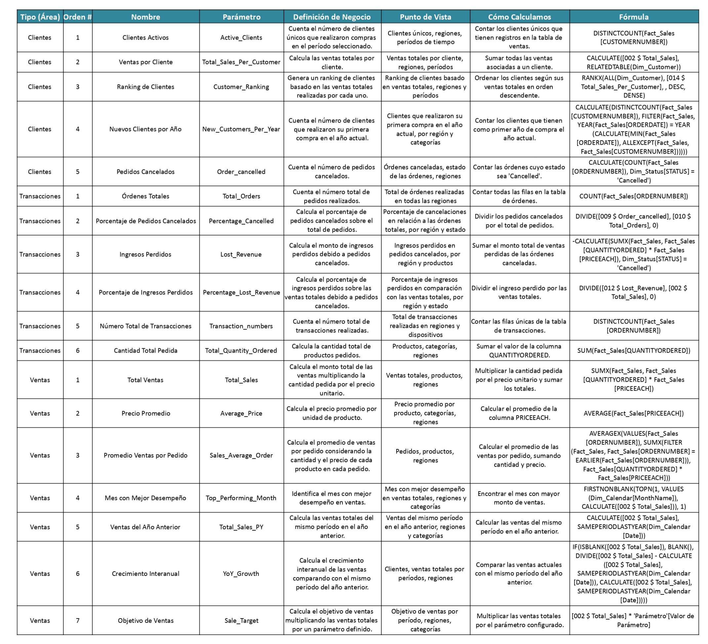

# Edvai_Data_Analysis
Proyecto final-Análisis de Ventas de Vehículos de Modelos a Escala
# Análisis de Ventas de Vehículos de Modelos a Escala

Este proyecto tiene como objetivo analizar las ventas de productos coleccionables, específicamente vehículos de modelos a escala, utilizando métricas clave (KPIs) y visualizaciones avanzadas para identificar patrones, tendencias y oportunidades de mejora en las operaciones comerciales.

## Caso de Estudio

Se utilizó un conjunto de datos proveniente de **Kaggle**, que representa transacciones de ventas de modelos a escala en diferentes categorías y tamaños de tratos. Este análisis permite explorar el comportamiento de los clientes, el rendimiento de las líneas de producto y las tendencias de ventas en distintas regiones y temporalidades.

## Herramientas

- **BigQuery**: Para almacenar y transformar los datos en una arquitectura Medallion (Bronze, Silver y Gold), permitiendo la construcción de tablas dimensionales y de hechos para el análisis.
- **Power Query**: Utilizado para la limpieza adicional de los datos y su integración en Power BI.
- **Power BI**: Para la creación de dashboards interactivos que destacan métricas clave, como `Sales` totales, crecimiento interanual y cancelaciones.
- **Canva** y **Figma**: Utilizados para diseñar elementos visuales, mejorar la presentación de los dashboards y documentar el proyecto de manera profesional.

## Metodología de Análisis

Se crearon dashboards interactivos en **Power BI** para representar métricas clave (KPIs) y evaluar hipótesis relacionadas con el desempeño de productos, hábitos de compra, tamaños de transacción (`DealSize`) y tendencias regionales. Adicionalmente, herramientas de diseño gráfico fueron utilizadas para optimizar la presentación visual del proyecto.

## Objetivos del Proyecto

1. Examinar tendencias de compra y analizar el comportamiento de los consumidores respecto a las categorías de productos.
2. Evaluar la influencia de las estaciones del año en el volumen de ventas.
3. Comparar la participación de diferentes regiones en los resultados de `Sales` totales.
4. Identificar oportunidades para aumentar la rentabilidad en productos de alta y baja rotación.
5. Proponer estrategias basadas en los tamaños de trato (`DealSize`) y el comportamiento de los clientes.

## Hipótesis de Negocio

1. Las ventas (`Sales`) aumentan durante el último trimestre del año debido a la estacionalidad de compras.
2. Las líneas de producto `Vintage Cars` y `Classic Cars` generan la mayor proporción de ingresos totales.
3. Los tratos de tamaño `Large` son los que más ingresos (`Sales`) generan, a pesar de ser menos frecuentes.
4. El territorio `NA` lidera en ingresos (`Sales`), siendo la región que más ingresos genera.
5. Se observa una disminución en nuevos clientes (`CustomersNew`) en el periodo de transición entre 2003 y 2004.

## Plan de Métricas

Para validar las hipótesis planteadas, se han definido **18 indicadores clave (KPIs)** que facilitan el análisis del comportamiento de los clientes y el desempeño de las transacciones.

A continuación, se presentan las métricas seleccionadas, acompañadas de su metodología de cálculo y las perspectivas desde las que pueden ser evaluadas. Información más detallada se encuentra disponible en la documentación del [Plan de Métricas](./plan-de-metricas).

